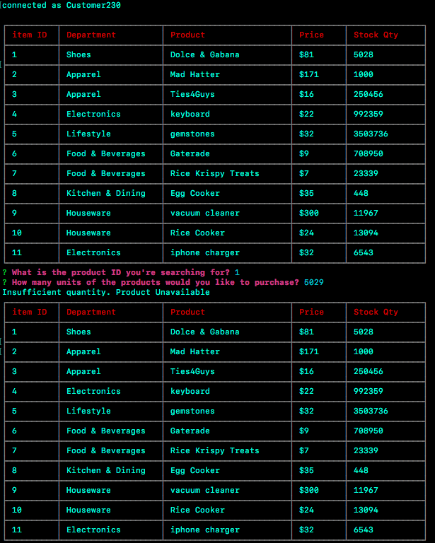

OVERVIEW

A Database to keep track of products price and availability, as well additonal options for Management to view inventory to add or remove products.

FUNCTIONALITY

*Customer App - customer is able to view current products and order items in bulk and view prices and quantities. If products are out of stock, customer will be notified of product unavailablility.

Customer view of all Inventory

Customer view to make selection by item ID to buy products, and inventory is updated to show available products after purchase

Customer view to buy all products and reflect purchase and remaining inventory

Customer attepmpts to buy product that is sold out, and receives error message of Product unavailability

*Manager App - Manager is able to view inventory to add new products, remove products, and check inventory.

Manager View Options

Manager View all inventory

Manager View low inventory

Manager View to add to low inventory

Manager View to add new product
